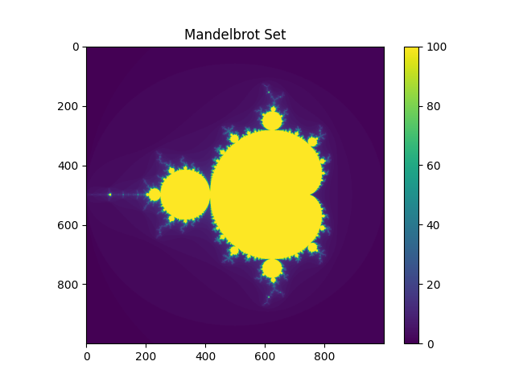

# Mandelbrot Benchmark



## Installation

1. Clone the repository:

   ```bash
   git clone https://github.com/ViktorooReps/mandelbrot-benchmark.git
   ```
   
2. Navigate to the project directory:

   ```bash
   cd mandelbrot-benchmark
   ```
   
3. Set up a Python virtual environment (recommended):

   ```bash
   python -m venv venv
   source venv/bin/activate  # On Windows: venv\Scripts\activate
   ```
   
4. Install the required dependencies:

   ```bash
   pip install -r requirements.txt
   ```

## Build

```
mkdir build
cd build
cmake .. -DCMAKE_BUILD_TYPE=Release
make
```
